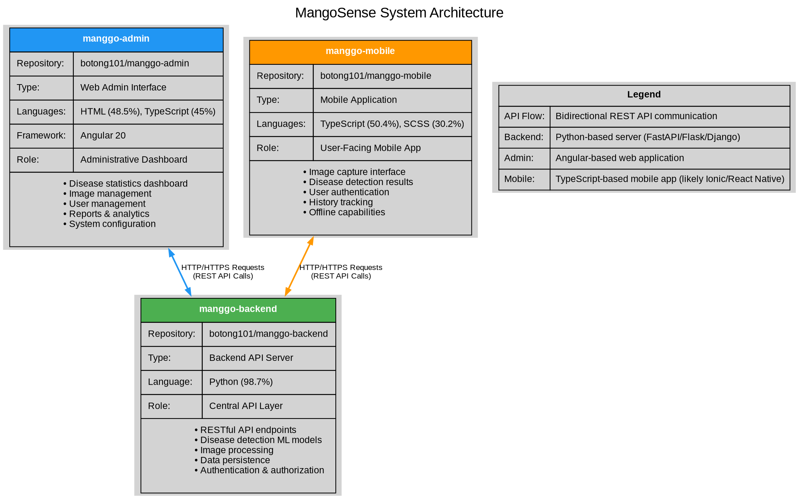

# MangoSense System Architecture

This document describes the architecture of the MangoSense ecosystem, which consists of three interconnected repositories working together to provide mango disease detection capabilities.

## System Overview

The MangoSense system is designed with a three-tier architecture:

1. **Backend API Server** (`manggo-backend`)
2. **Administrative Web Interface** (`manggo-admin`)  
3. **User-Facing Mobile Application** (`manggo-mobile`)

## Repository Roles

### 1. manggo-backend
**Repository:** `botong101/manggo-backend`

**Primary Language:** Python (98.7%)

**Purpose:** Central API layer providing backend services for the entire ecosystem

**Key Responsibilities:**
- RESTful API endpoints for all client applications
- Machine learning models for disease detection
- Image processing and analysis
- Data persistence and database management
- User authentication and authorization
- Business logic and data validation

### 2. manggo-admin (This Repository)
**Repository:** `botong101/manggo-admin`

**Primary Languages:** HTML (48.5%), TypeScript (45%)

**Framework:** Angular 20

**Purpose:** Web-based administrative dashboard

**Key Responsibilities:**
- Disease statistics visualization
- Image library management
- User management and access control
- System reports and analytics
- Configuration and settings management
- Administrative oversight of the entire system

### 3. manggo-mobile
**Repository:** `botong101/manggo-mobile`

**Primary Languages:** TypeScript (50.4%), SCSS (30.2%)

**Purpose:** Mobile application for end-users

**Key Responsibilities:**
- Mango leaf/fruit image capture
- Real-time disease detection requests
- Display of detection results and recommendations
- User authentication and profile management
- Detection history tracking
- Offline capability for certain features

## Communication Flow

### Backend ↔ Admin
The admin web application communicates with the backend via HTTP/HTTPS using RESTful API calls:
- Authentication requests
- Dashboard statistics retrieval
- Image upload and management
- User CRUD operations
- Report generation requests

### Backend ↔ Mobile
The mobile application communicates with the backend via HTTP/HTTPS using RESTful API calls:
- User authentication and registration
- Image upload for disease detection
- Detection results retrieval
- User profile management
- Historical data synchronization

## Architecture Diagrams

Below is the visual representation of the MangoSense system architecture:



### Graphviz DOT Format
The file `architecture.dot` contains a detailed architectural diagram in Graphviz DOT format that can be edited and regenerated.

To render this diagram:

```bash
# Install Graphviz (if not already installed)
# Ubuntu/Debian
sudo apt-get install graphviz

# macOS
brew install graphviz

# Windows
choco install graphviz

# Render to PNG
dot -Tpng architecture.dot -o architecture.png

# Render to SVG
dot -Tsvg architecture.dot -o architecture.svg

# Render to PDF
dot -Tpdf architecture.dot -o architecture.pdf
```

### LaTeX/TikZ Format
The file `architecture.tex` contains an alternative diagram in LaTeX/TikZ format.

To compile this diagram:

```bash
# Install LaTeX (if not already installed)
# Ubuntu/Debian
sudo apt-get install texlive-latex-base texlive-latex-extra

# macOS
brew install --cask mactex

# Compile to PDF
pdflatex architecture.tex

# Or use standalone class for just the diagram
pdflatex --shell-escape architecture.tex
```

## Technology Stack

### Backend (manggo-backend)
- **Language:** Python
- **Likely Frameworks:** FastAPI, Flask, or Django
- **ML Libraries:** TensorFlow, PyTorch, scikit-learn, or similar
- **Image Processing:** OpenCV, PIL/Pillow
- **Database:** PostgreSQL, MongoDB, or MySQL

### Admin (manggo-admin)
- **Framework:** Angular 20
- **Language:** TypeScript
- **Styling:** Tailwind CSS, HTML/CSS
- **Build Tool:** Angular CLI
- **UI Components:** Custom components with modern design

### Mobile (manggo-mobile)
- **Language:** TypeScript
- **Styling:** SCSS
- **Likely Framework:** Ionic, React Native, or similar
- **Mobile Platforms:** iOS and Android

## Data Flow Example: Disease Detection

1. **User captures image** (Mobile App)
2. **Image sent to backend** via REST API (Mobile → Backend)
3. **Backend processes image** using ML model
4. **Results returned** to mobile app (Backend → Mobile)
5. **Admin views statistics** (Admin → Backend)
6. **Backend aggregates data** from all detections
7. **Dashboard updated** with latest statistics (Backend → Admin)

## Security Considerations

- All API communications use HTTPS encryption
- JWT or session-based authentication
- Role-based access control (Admin vs. User)
- Input validation on both client and server
- Image upload size and format restrictions
- Rate limiting on API endpoints

## Deployment Architecture

```
┌─────────────────┐
│   End Users     │
│   (Mobile App)  │
└────────┬────────┘
         │
         │ HTTPS
         │
    ┌────▼────────────────────┐
    │                         │
    │   Load Balancer /       │
    │   API Gateway           │
    │                         │
    └─────┬─────────────┬─────┘
          │             │
    ┌─────▼─────┐ ┌────▼──────┐
    │  Backend  │ │  Backend  │
    │  Server 1 │ │  Server 2 │
    └─────┬─────┘ └────┬──────┘
          │            │
          └──────┬─────┘
                 │
         ┌───────▼────────┐
         │                │
         │   Database     │
         │   (Primary)    │
         │                │
         └────────────────┘

┌──────────────────┐
│  Administrators  │
│  (Web Browser)   │
└────────┬─────────┘
         │
         │ HTTPS
         │
    ┌────▼────────────────────┐
    │                         │
    │   Web Server            │
    │   (Admin Frontend)      │
    │                         │
    └─────────────────────────┘
```

## Future Enhancements

- Real-time notifications using WebSockets
- GraphQL API as an alternative to REST
- Microservices architecture for better scalability
- CDN for static assets and images
- Redis caching layer for improved performance
- Message queue for asynchronous processing (e.g., Celery, RabbitMQ)

## Contributing

When contributing to any of these repositories, please ensure:
- API contracts between components remain consistent
- Changes to the backend API are communicated to frontend teams
- Comprehensive testing of integrations
- Documentation updates for architectural changes

## Related Documentation

- [Backend API Documentation](https://github.com/botong101/manggo-backend)
- [Mobile App Documentation](https://github.com/botong101/manggo-mobile)
- [Admin Dashboard Design Updates](../DESIGN_UPDATES.md)
- [Main README](../README.md)
